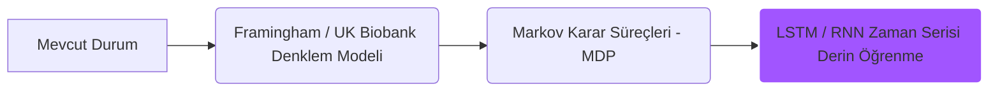

# Biyofiziksel Kardiyovasküler Dijital İkiz Projesi Değerlendirme ve Yol Haritası Raporu

Bu rapor; projenin genel mantığı, fizyolojik gerçeklik seviyesi, düzeltilmesi gereken kritik noktalar, ML modellerinin çalışma başarısı ve geleceğe yönelik zamana bağlı tahmin yeteneklerinin geliştirilmesi üzerine yapılmış bütüncül bir değerlendirmedir.

---

## 1. Proje Mantıklı ve Anlamlı mı? (Genel Değerlendirme)

**Evet, kesinlikle çok mantıklı, yenilikçi ve ticari/klinik potansiyeli yüksek bir projedir.**

*   **Fizik ve ML Evliliği (Physics-Informed ML):** Klasik yapay zeka modelleri sadece verideki korelasyonları öğrenir ve fizik kurallarını ihlal edebilir. Fizyolojik bir diferansiyel denklem sistemini (3-Element Windkessel) makine öğrenmesi (XGBoost) ile birleştirmek, literatürde **Physics-Informed Machine Learning (PIML)** veya **Biyolojik Dijital İkiz** olarak adlandırılan en güncel yaklaşımlardan biridir.
*   **Klinik Değer:** Girişimsel olmayan (non-invaziv) yöntemlerle damar direnci ($R$) ve damar esnekliği ($C$) gibi kritik parametreleri tahmin etmek klinik olarak çok değerlidir. Normal şartlarda bu parametreleri doğrudan ölçmek için hastaya kateter takılması (invaziv ölçüm) gerekir. Bu projenin amacı, hastanın sadece kol tansiyonu ve nabız verisiyle bu parametreleri tahmin etmektir.

---

## 2. Gerçekçilik Seviyesi Nedir?

Projenin gerçekçilik seviyesini iki farklı boyutta ele almamız gerekir:

### A. Hemodinamik Modelleme (Windkessel Çözücü): **8 / 10 (Yüksek Gerçekçilik)**
*   Diferansiyel denklemler ve sistolik fazdaki kan akışını modelleyen sinüs dalgası (`generate_inflow`) fizyolojik gerçeklere oldukça uygundur. 
*   Eğer veri setindeki denklem hatası (aort empedansı basınç düşüşünün unutulması) düzeltilirse, bu katman akademik yayın kalitesinde bir gerçekliğe sahiptir.

### B. Yaşam Tarzı ve Zaman Simülasyonu (`time_simulator.py`): **4 / 10 (Düşük Gerçekçilik)**
*   Simülasyondaki zaman akış parametreleri ve değişim oranları (örneğin spora başlayınca damar esnekliğinin $C$ üstel olarak %15 artması veya sigara içince direncin $R$ %25 artması) **tamamen sezgisel varsayımlara (heuristics)** dayanmaktadır.
*   *Gerçekte:* Yaşam tarzı değişikliklerinin damar yapısı üzerindeki etkisi (vascular remodeling) hastanın genetiğine, yaşına, cinsiyetine ve başlangıçtaki damar hasarına bağlı olarak kişiden kişiye değişir ve aylar/yıllar alır. Grip gibi akut durumların etkisi ise çok daha karmaşık geçici dinamiklere sahiptir.

---

## 3. Nerelerin Düzenlenmesi Gerekir?

Projenin kalitesini artırmak için öncelikle şu kritik hatalar düzeltilmelidir:

1.  **Fizik Denklemi Tutarsızlığı (En Acil Adım):**
    *   [generaete_dataset_3.py](file:///Users/denizsahiner/Desktop/digital_twin/data_set_generator/generaete_dataset_3.py) içindeki veri üretme koduna $Q(t) \times Z_c$ terimi eklenmeli ve Windkessel modeli (`realistic_model.pkl`) bu doğru veri setiyle yeniden eğitilmelidir. (İndirilenler altındaki `windkessel3_dataset.csv` bu kurala uymaktadır).
2.  **Cardio Modelindeki Habit Bias (Seçim Yanlılığı):**
    *   Sigara ve alkolün kalp sağlığı riskini düşürdüğü şeklindeki veri seti yanlılığı giderilmelidir. Model eğitilirken XGBoost'un **`monotone_constraints`** parametresi kullanılarak sigara ve alkolün riski sadece artırabileceği kuralı modele matematiksel olarak dikte edilmelidir.
3.  **Yaşa Bağlı Doğal Yıpranma (Vascular Aging):**
    *   Simülasyon sürecinde damar esnekliğinin ($C$) yaşlandıkça doğal olarak azalması (örneğin her 10 yılda bir %5 azalma) gibi tıbbi olarak kanıtlanmış doğal yaşlanma denklemleri simülasyon motoruna eklenmelidir.

---

## 4. ML Modelleri Doğru Çalışıyor mu? Doğruluk Artırılabilir mi?

### Windkessel Modeli:
*   **Mevcut Durum:** $R$ (direnç) tahmini doğru çalışıyor ancak $C$ (esneklik) tahmini, eğitim veri setindeki denklem hatasından ötürü gerçek vitallerle test edildiğinde yanlış sonuçlar üretiyor.
*   **Doğruluk Nasıl Artırılır?**
    *   Sadece SBP ve DBP gibi statik değerler yerine, **tüm nabız dalga şeklinden (pulse wave contour)** çıkarılan öznitelikler (yukarı çıkış eğimi, dikrotik çentik noktası, diyastolik sönümleme hızı vb.) girdi olarak kullanılmalıdır. Downloads klasöründeki `windkessel_parameters_dataset.csv` tam olarak bu mantıkla hazırlanmıştır ve bu yöndeki geçiş doğruluğu dramatik şekilde artıracaktır.

### Cardio Risk Modeli:
*   **Mevcut Durum:** Yaş ve tansiyon etkileri mantıklı çalışırken, sigara/alkol etkileri veri seti gürültüsü nedeniyle tamamen yanlış çalışmaktadır.
*   **Doğruluk Nasıl Artırılır?**
    *   Kullanıcıya isteğe bağlı olarak kolesterol (LDL/HDL), troponin veya kreatinin gibi temel laboratuvar değerlerini girebilme imkanı tanınmalıdır. Lab verilerinin eklenmesi risk tahmininin doğruluğunu %72'den %85+ seviyelerine çıkaracaktır.

---

## 5. Zamana Bağlı Tahmin Geliştirilebilir mi? (Yol Haritası)

Evet, basit kural tabanlı üstel yumuşatma (exponential smoothing) yerine projenize gerçek bir **zamana bağlı klinik tahmin motoru** kazandırılabilir:

### Aşama 1: Klinik Kohort Modelleriyle Entegrasyon
*   *Çözüm:* Framingham Kalp Çalışması veya UK Biobank gibi 10-20 yıl boyunca binlerce hastayı takip etmiş büyük klinik veri setlerinin zaman serisi denklemleri projeye entegre edilebilir. Sigarayı bırakmanın 1. yılında, 5. yılında ve 10. yılında riskin tam olarak ne kadar düştüğü bu klinik formüllerle simüle edilebilir.

### Aşama 2: Markov Zincirleri (State Transitions)
*   *Çözüm:* Hastanın sağlığı "Sağlıklı", "Hafif Hasarlı", "Hipertansif", "Kritik Risk" gibi durumlara (states) ayrılır. Yaşam tarzı seçimleri ve zaman geçişi, bu durumlar arasındaki geçiş olasılıklarını (transition probabilities) belirler. Bu, zamana bağlı risk değişimlerini çok daha gerçekçi ve olasılıksal hale getirir.

### Aşama 3: Zaman Serisi Derin Öğrenmesi (LSTM / RNN)
*   *Çözüm:* Eğer elinizde hastaların zamana bağlı klinik takip verileri (elektronik sağlık kayıtları) varsa, zaman serisi tahminleri yapan **LSTM (Long Short-Term Memory)** veya **GRU** gibi yapay sinir ağları eğitilebilir. Bu modeller hastanın son 3 yıldaki tansiyon trendine bakarak önümüzdeki 5 yılda damarlarının nasıl bir patika izleyeceğini tahmin edebilir.

---

## 6. Modelleme Varsayımları ve Klinik Sınırlar

> [!IMPORTANT]
> **1. Framingham Risk-Parametre Eşleme Varsayımı (Bridge Assumption):**
> Framingham / UK Biobank klinik kohort çalışmaları popülasyon düzeyinde göreceli risk ($HR$) zaman eğrileri sunmaktadır (örneğin *"sigara bırakıldıktan $X$ zaman sonra kardiyovasküler risk $Y$ oranında düşer"*). Ancak projemiz bireysel biyofiziksel $R$ (direnç) ve $C$ (esneklik) parametrelerini modellemektedir. Popülasyon-düzeyi risk azalma zaman sabitleri, bireysel $R/C$ parametre toparlanma oranlarına **savunulabilir bir modelleme köprü varsayımı (bridge assumption)** olarak haritalanmıştır.
>
> **2. Zaman Sınırı (1 Yıl Ufku - $\le 365$ Gün):**
> Birikimli uzun vadeli belirsizliklerin (genetik, metabolik kontrol ve vasküler yeniden yapılanma dinamikleri) tahmin sapmalarına yol açmasını önlemek adına, simülasyon motoru projeksiyonları **kesin olarak maksimum 1 YIL (365 GÜN)** ile kısıtlanmıştır.
